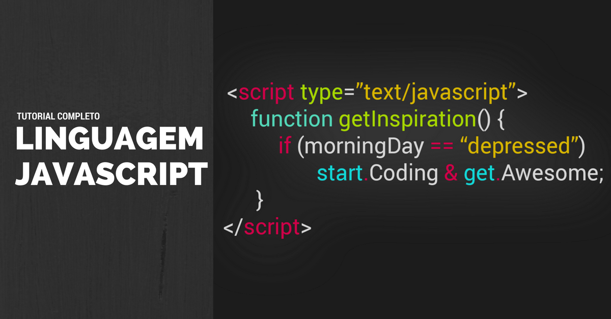
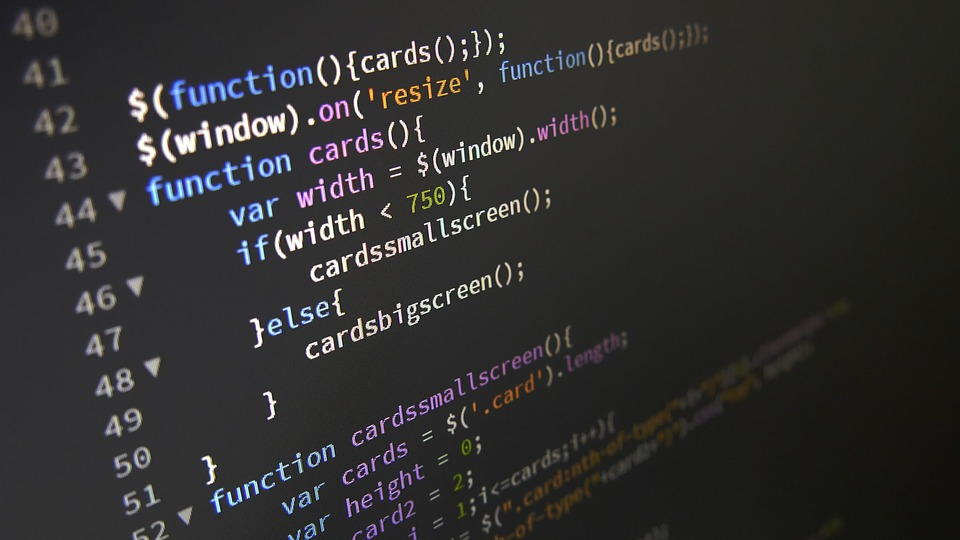

# miniwikipedia

<!doctype html>
<html>
    <head>
        <meta charset='utf-8'>
        <title> miniWikipedia </title>
    </head>
    
    
    <body>
        

        <footer> 

            
            <a href="#definicao">Definição |</a>
            <a href="#caracteristicas">Características |</a>
            <a href="#ferramentasdedev">Ferramentas de Desenvolvimento |</a>
            <a href="#excodigo">Exemplos de Código |</a>
            <a href="#videocurto">Video Curto |</a>
            <a href="#referencia">Referência |</a>
            
    

        </footer>

        
        

            <header>
                <h3>Definição</h3>
                
            </header>
        
            
JavaScript® (às vezes abreviado para JS) é uma linguagem leve,
               interpretada e baseada em objetos com funções de primeira classe,
               mais conhecida como a linguagem de script para páginas Web, mas 
               usada também em vários outros ambientes sem browser, tais como node.js,  
               Apache CouchDB e Adobe Acrobat. O JavaScript é uma linguagem baseada em 
               protótipos, multi-paradigma e dinâmica, suportando estilos de orientação
               a objetos, imperativos e declarativos (como por exemplo a programação funcional). 

               <a href="#inicio">Voltar</a>
               

               
        
        
        

        <header>
            <h3>Características</h3>

        </header>
        
        
O padrão JavaScript é ECMAScript. Desde 2012, todos os navegadores modernos possuem
           suporte total ao ECMAScript 5.1. Navegadores mais antigos suportam pelo menos ECMAScript 
           3. Em 17 de Junho de 2015, a ECMA International publicou a sexta versão do ECMAScript, que
           é oficialmente chamado de ECMAScript 2015, e foi inicialmente conhecido como ECMAScript 6
            ou ES6. Desde então, as especificações do ECMAScript são lançadas anualmente. Essa documentação
             faz referência à última versão de referência, que atualmente é a ECMAScript 2018.

            Não se deve confundir o JavaScript com a linguagem de programação Java. Tanto Java quanto 
            JavaScript são marcas registradas da Oracle nos Estados Unidos da América e em outros países.
             No entanto, as duas linguagens de programação possuem sintaxe, semânticas e usos muito diferentes.

        

        <a href="#inicio">Voltar</a>
        

        

        <header>
            <h3>Ferramentas de Desenvolvimento</h3>
        </header>

        
 ActiveState Komodo IDE 7 tem suporte para desenvolvimento em JavaScript, além de outras
           linguagen como PHP, Python, e Ruby. O Aptana Studio 3 é uma ferramenta open source de 
           desenvolvimento Web que suporta assistência de código para JavaScript, HTML e CSS para 
           facilitar o desenvolvimento. 4D Wakanda é uma ferramenta de desenvolvimento JavaScript 
           para construir aplicações tanto para Web quanto para plataformas móveis. A suíte inclui
           o Wakanda Server que apresenta uma datastore para hospedar dados de aplicativos e modelos
           e é movida pelo motor de objetos WakandaDB NoSQL.

        

        <a href="#inicio">Voltar</a>
        

        

        <header>
            <h3>Exemplos de Código</h3>
            
        </header>
        

            
            
        

        <a href="#inicio">Voltar</a>
        

        

        <header>
            <h3>Vídeo Curto Explicativo</h3>
        </header>
        

        

            <video poster="capajs.png" src="JSEM6MINUTOS.mp4" controls width="800">
                
                
                    Seu browser não suporta a tag de vídeo.   
            </video>
        

        <a href="#inicio">Voltar</a>
        

        

        <header>
            <h3>Referência</h3>
        </header>
        
        <ol>
            <li>DevMedia, 2013.</li>
            <li>Código Fonte - Tecnologia de A-Z, 2013.</li>
            <li>YouTube - DevMedia, 2019.</li>
        </ol>
        <a href="#inicio">Voltar</a>
        

    </body>

    </html>
